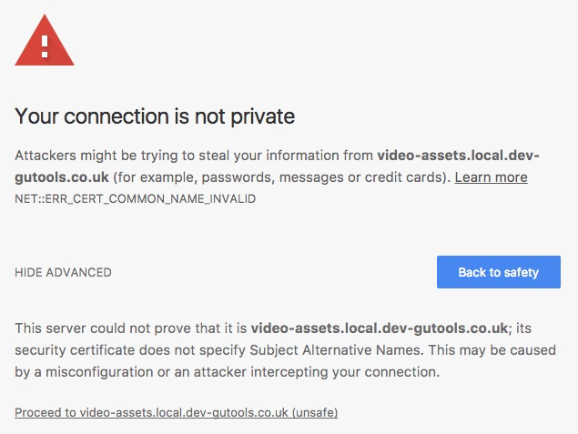
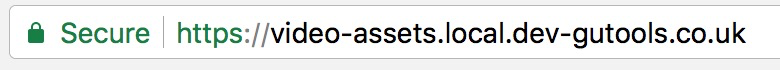

# Getting Green with Chrome

If you're doing frontend dev using the shared local cert and dev-nginx, you've probably seen this a few times in Chrome. 
Whilst not blocking, it can be a little annoying.



## Why?
Chrome [removed support](https://www.chromestatus.com/feature/4981025180483584) for commonName matching in 58. 
Further details [here](https://developers.google.com/web/updates/2017/03/chrome-58-deprecations#remove_support_for_commonname_matching_in_certificates)

The best solution to this would be to reissue the certificate with the subject alternative name set. 
However, this is not trivial and requires `34444`.

## How?
The quick solution would be to [EnableCommonNameFallbackForLocalAnchors](https://www.chromium.org/administrators/policy-list-3#EnableCommonNameFallbackForLocalAnchors):

> When this setting is enabled, Google Chrome will use the commonName of a server certificate to match a hostname if the 
certificate is missing a subjectAlternativeName extension, as long as it successfully validates and chains to a 
locally-installed CA certificates.

So, assuming you've trusted the certificates, you can run:

```bash
defaults write com.google.Chrome EnableCommonNameFallbackForLocalAnchors -bool true
```

Then restarting Chrome, you should get a green padlock:



## Edit Chrome's SSL recognition? Sounds fishy!
Setting this flag only allows common name fallback for locally installed CA certificates, 
so there should not be any security concerns (assuming we trust our own certificates).
